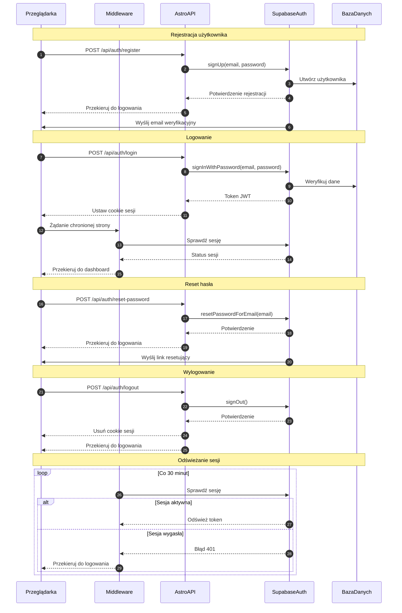

# Diagram Sekwencji Autentykacji

```mermaid
sequenceDiagram
    autonumber
    participant Przeglądarka
    participant Middleware
    participant AstroAPI
    participant SupabaseAuth
    participant BazaDanych

    Note over Przeglądarka,BazaDanych: Rejestracja użytkownika
    Przeglądarka->>AstroAPI: POST /api/auth/register
    AstroAPI->>SupabaseAuth: signUp(email, password)
    SupabaseAuth->>BazaDanych: Utwórz użytkownika
    SupabaseAuth-->>AstroAPI: Potwierdzenie rejestracji
    AstroAPI-->>Przeglądarka: Przekieruj do logowania
    SupabaseAuth->>Przeglądarka: Wyślij email weryfikacyjny

    Note over Przeglądarka,BazaDanych: Logowanie
    Przeglądarka->>AstroAPI: POST /api/auth/login
    AstroAPI->>SupabaseAuth: signInWithPassword(email, password)
    SupabaseAuth->>BazaDanych: Weryfikuj dane
    SupabaseAuth-->>AstroAPI: Token JWT
    AstroAPI-->>Przeglądarka: Ustaw cookie sesji
    Przeglądarka->>Middleware: Żądanie chronionej strony
    Middleware->>SupabaseAuth: Sprawdź sesję
    SupabaseAuth-->>Middleware: Status sesji
    Middleware-->>Przeglądarka: Przekieruj do dashboard

    Note over Przeglądarka,BazaDanych: Reset hasła
    Przeglądarka->>AstroAPI: POST /api/auth/reset-password
    AstroAPI->>SupabaseAuth: resetPasswordForEmail(email)
    SupabaseAuth-->>AstroAPI: Potwierdzenie
    AstroAPI-->>Przeglądarka: Przekieruj do logowania
    SupabaseAuth->>Przeglądarka: Wyślij link resetujący

    Note over Przeglądarka,BazaDanych: Wylogowanie
    Przeglądarka->>AstroAPI: POST /api/auth/logout
    AstroAPI->>SupabaseAuth: signOut()
    SupabaseAuth-->>AstroAPI: Potwierdzenie
    AstroAPI-->>Przeglądarka: Usuń cookie sesji
    AstroAPI-->>Przeglądarka: Przekieruj do logowania

    Note over Przeglądarka,BazaDanych: Odświeżanie sesji
    loop Co 30 minut
        Middleware->>SupabaseAuth: Sprawdź sesję
        alt Sesja aktywna
            SupabaseAuth-->>Middleware: Odśwież token
        else Sesja wygasła
            SupabaseAuth-->>Middleware: Błąd 401
            Middleware-->>Przeglądarka: Przekieruj do logowania
        end
    end
``` 