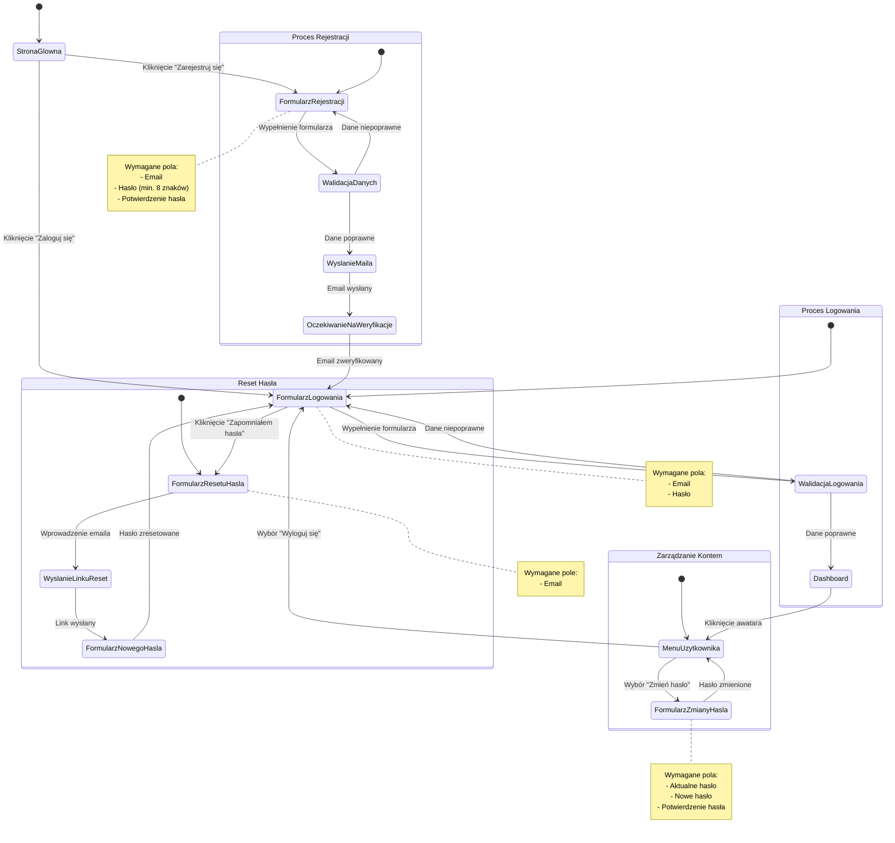

# Diagram Podróży Użytkownika - System Autentykacji

Diagram przedstawia pełną podróż użytkownika przez system autentykacji, w tym procesy rejestracji, logowania, zarządzania kontem i resetowania hasła.

Diagram został utworzony przy użyciu narzędzia Mermaid i przedstawia:
- Stany systemu
- Przejścia między stanami
- Warunki przejść
- Notatki informacyjne
