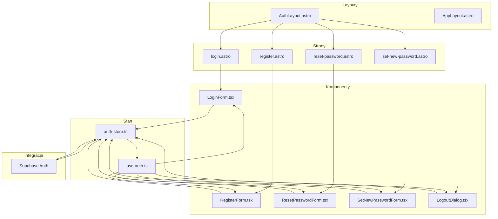

# Diagram UI - System Autentykacji

```mermaid
flowchart TD
    subgraph Layouty
        AuthLayout[AuthLayout.astro]
        AppLayout[AppLayout.astro]
    end

    subgraph Strony
        LoginPage[login.astro]
        RegisterPage[register.astro]
        ResetPasswordPage[reset-password.astro]
        SetNewPasswordPage[set-new-password.astro]
    end

    subgraph Komponenty
        LoginForm[LoginForm.tsx]
        RegisterForm[RegisterForm.tsx]
        ResetPasswordForm[ResetPasswordForm.tsx]
        SetNewPasswordForm[SetNewPasswordForm.tsx]
        LogoutDialog[LogoutDialog.tsx]
    end

    subgraph Stan
        AuthStore[auth-store.ts]
        UseAuth[use-auth.ts]
    end

    subgraph Integracja
        SupabaseAuth[Supabase Auth]
    end

    AuthLayout --> LoginPage
    AuthLayout --> RegisterPage
    AuthLayout --> ResetPasswordPage
    AuthLayout --> SetNewPasswordPage

    AppLayout --> LogoutDialog

    LoginPage --> LoginForm
    RegisterPage --> RegisterForm
    ResetPasswordPage --> ResetPasswordForm
    SetNewPasswordPage --> SetNewPasswordForm

    LoginForm --> AuthStore
    RegisterForm --> AuthStore
    ResetPasswordForm --> AuthStore
    SetNewPasswordForm --> AuthStore
    LogoutDialog --> AuthStore

    AuthStore --> UseAuth
    UseAuth --> LoginForm
    UseAuth --> RegisterForm
    UseAuth --> ResetPasswordForm
    UseAuth --> SetNewPasswordForm
    UseAuth --> LogoutDialog

    AuthStore --> SupabaseAuth
    SupabaseAuth --> AuthStore
``` 